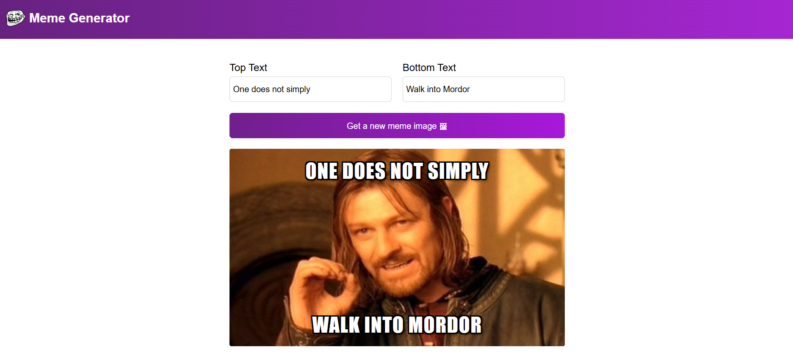
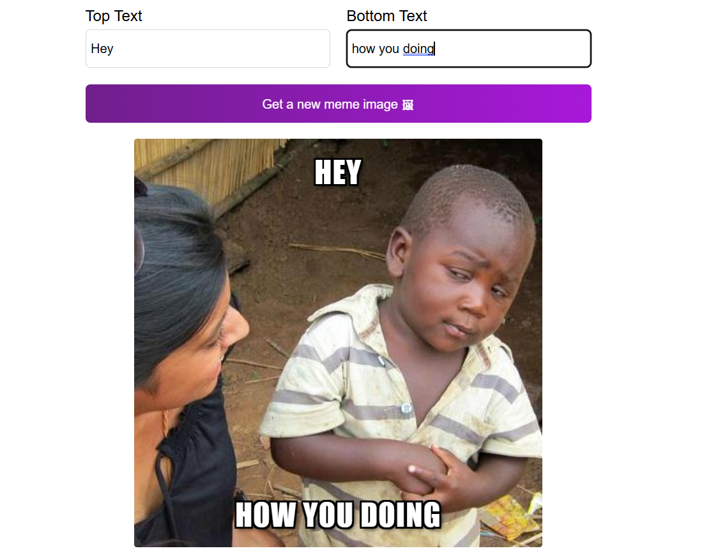

# Meme Generator

A React application that generates memes using images fetched from an external API. Users can add custom top and bottom text to create their own memes instantly.

## 🚀 Features

- Fetches random meme templates from an API
- Generate a new random meme
- Add custom top and bottom text
- Instant live preview
- Responsive layout
- Clean and intuitive user interface

## 🛠️ Built With

- React
- JavaScript (ES6+)
- HTML5
- CSS3
- Vite
- Fetch API

## 📸 Screenshots



## 🧠 What I Learned

This project helped me strengthen my understanding of:

- React components
- State management with `useState`
- Side effects using `useEffect`
- Fetching data from APIs
- Handling asynchronous JavaScript
- Forms and controlled inputs
- Conditional rendering
- Working with external data

## ▶️ Getting Started

Clone the repository:

```bash
git clone https://github.com/your-username/meme-generator.git
```

Navigate into the project:

```bash
cd meme-generator
```

Install dependencies:

```bash
npm install
```

Start the development server:

```bash
npm run dev
```

## 🎯 Future Improvements

- Download memes as images
- Add text customization (font, color, size)
- Drag and position text anywhere
- Favorite memes
- Search meme templates

## 📄 License

This project is open source and available under the MIT License.
